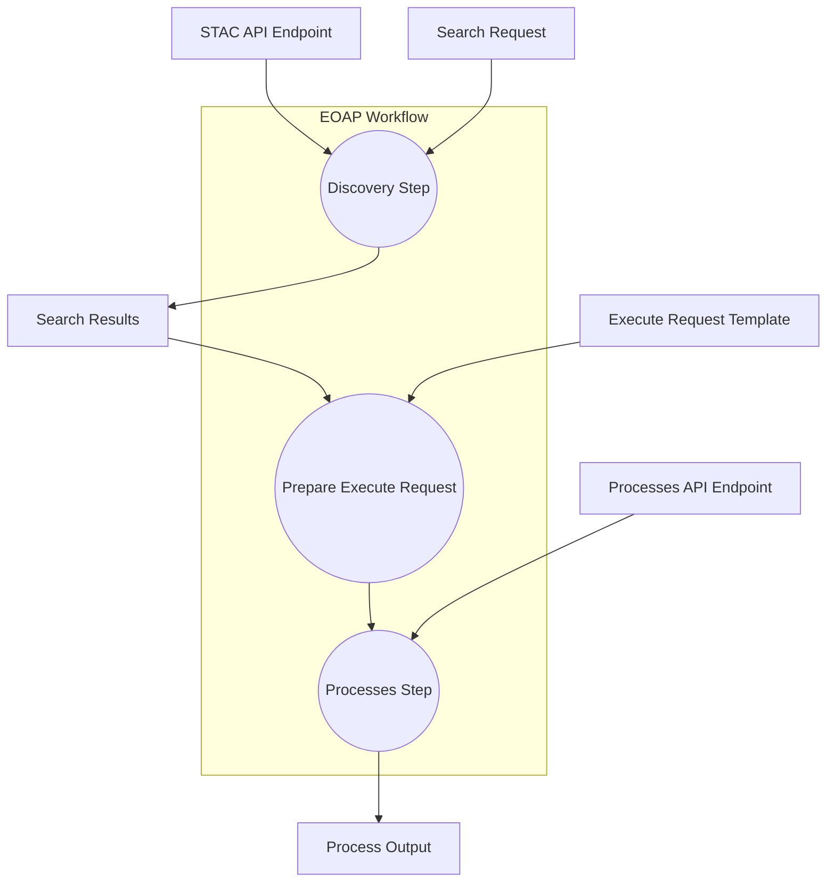

### EOAP API Workflow - Orchestrating CWL CommandLineTools
The **EOAP API Workflow** chains together three main steps — `discovery`, `prepare-execute-request`, and `processes` — to query a STAC API, prepare an OGC API Processes execution request, and finally run the requested process.

It takes the following input parameters:

* a STAC API endpoint
* a STAC search request (query parameters)
* a Processes API endpoint
* an execution request template for OGC API Processes

And produces as outputs:

* the results of the STAC search (search results as a JSON file)
* the process execution result (OGC API Process output as a JSON file)



### Workflow Steps

1. **Discovery Step**
   Uses the provided `stac_api_endpoint` and `search_request` to query a STAC API. The result is saved as `search_output`.

2. **Prepare Execute Request Step**
   Combines the initial `execute_request` template with the `search_output` from the discovery step.

   * Extracts STAC item URLs from the search results.
   * Inserts them into the `.inputs.stac_items` field of the execution request.
   * Removes the `process_id` from the request and stores it separately.
     Outputs:

   - `execute_request.json` — the updated request ready to be sent.
   - `process_id.json` — the process identifier.

3. **Processes Step**
   Executes the OGC API Process using the `processes_api_endpoint`, the prepared `execute_request.json`, and the `process_id`. The result is stored in `feature-collection.json`.


The CWL Workflow is shown below and the lines highlighted chain the steps:

```yaml linenums="1" hl_lines="8-71" title="app-water-body-cloud-native.cwl"
--8<--
cwl-workflow/eoap-api-cli.cwl
--8<--
```